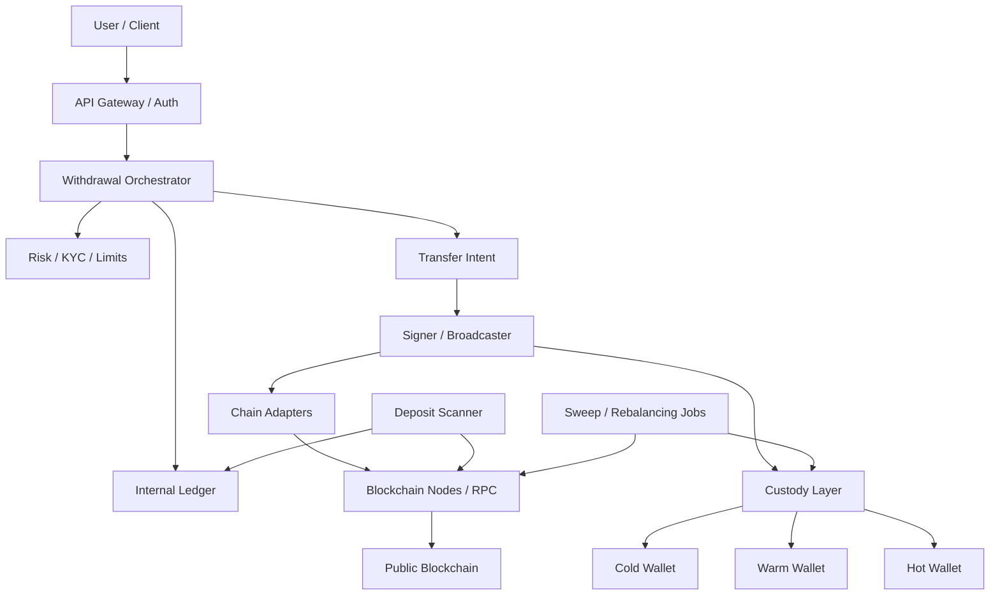
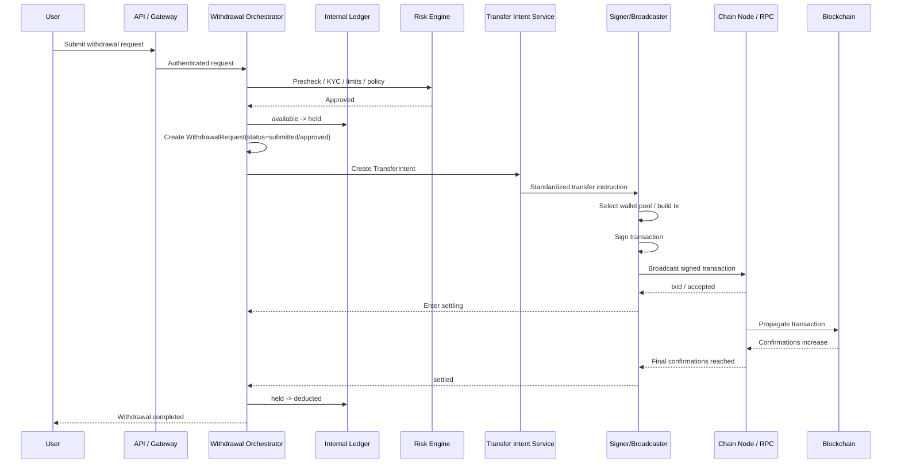
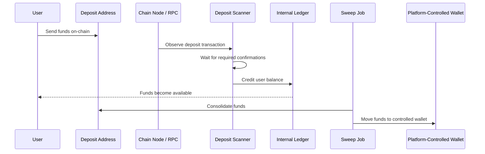
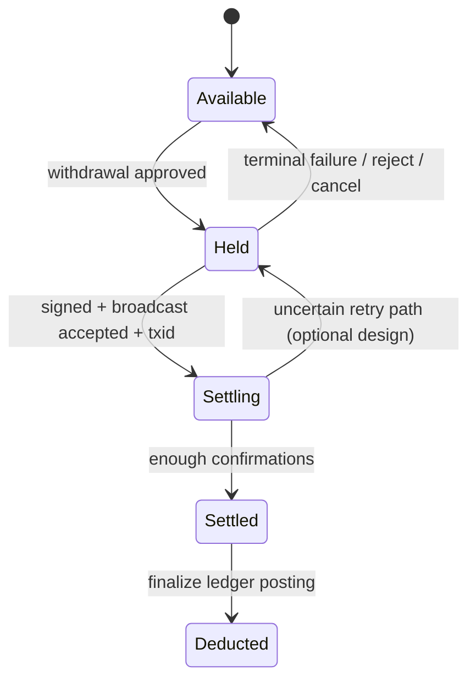
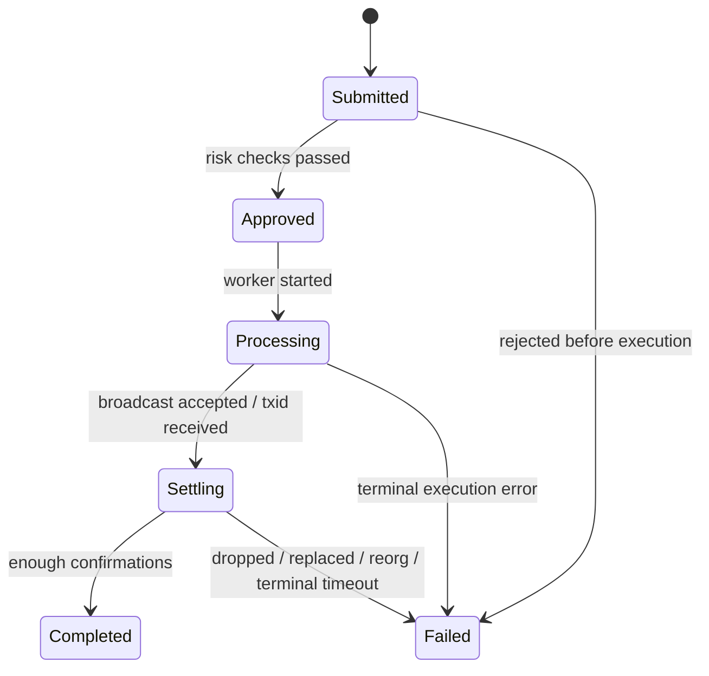
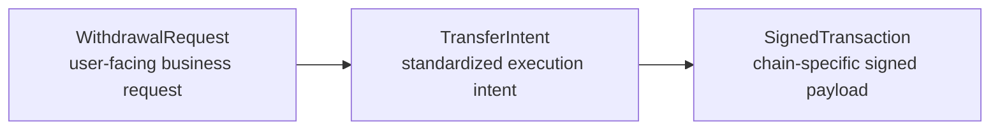
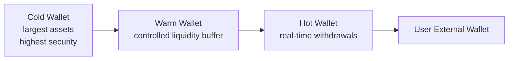
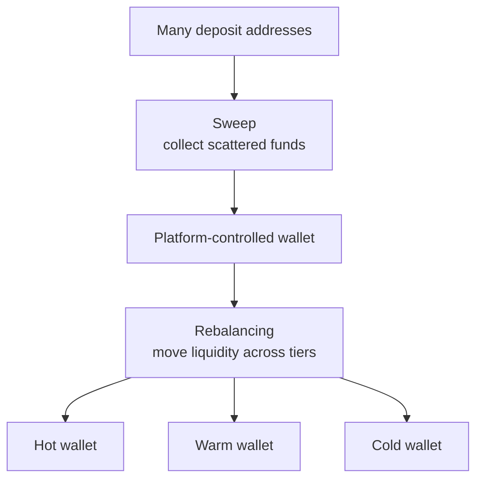
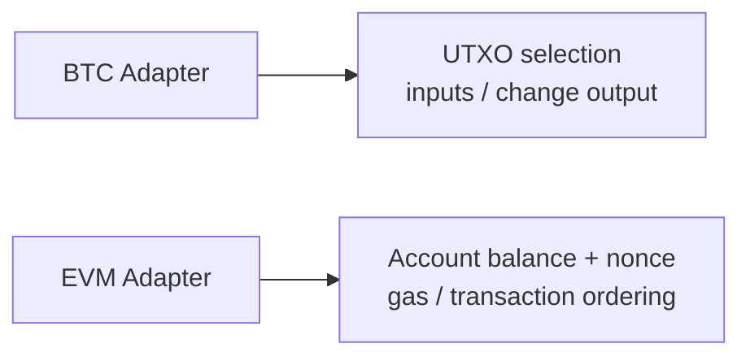

# Bybit-Style CEX Wallet System Summary

## 1. System Layers

## 2. Withdrawal End-to-End Sequence

## 3. Deposit Path

## 4. Two Independent State Machines

## 5. Core Objects

- `WithdrawalRequest`: user intent, business workflow, risk/KYC context
- `TransferIntent`: execution-ready instruction, request id, asset, amount, chain, wallet pool, destination
- `SignedTransaction`: chain-specific signed payload to broadcast

## 6. Wallet Tier Model

- `Hot wallet`: real-time withdrawals, smallest balance, highest exposure
- `Warm wallet`: refill hot wallet, slower and higher-control path
- `Cold wallet`: majority of assets, strictest approval and custody controls

## 7. Sweep vs Rebalancing

## 8. BTC vs EVM Adapter Difference

- BTC is output-based: you spend specific outputs and may need change
- EVM is account-based: you spend from account balance and need nonce ordering
- Therefore `BTC adapter` and `EVM adapter` should not share the exact same tx-building logic

## 9. What We Established

1. CEX internal trading does **not** require on-chain settlement for every trade.
2. The exchange wallet system is not just "an address holding money"; it is a system of:
   - internal ledger
   - withdrawal orchestration
   - signing/broadcast
   - custody tiers
   - chain adapters
   - reconciliation and operations
3. Balance state and workflow state are different:
   - balance line: `available -> held -> deducted`
   - request line: `submitted -> approved -> processing -> settling -> completed/failed`
4. `txid` does not mean final success; broadcast acceptance and final confirmation are different phases.
5. Retryable failures and terminal failures must be handled differently:
   - retryable: usually keep funds held
   - terminal: fail request and release funds
6. Deposit crediting and sweep are different:
   - crediting adds internal user balance
   - sweep consolidates chain funds back into platform-controlled wallets
7. Wallet tiers exist to balance liquidity and safety, not merely to classify assets by size.

## 10. Suggested Next Steps

1. Design the actual database schema for balances, withdrawal requests, and transfer intents.
2. Draw a production-grade sequence diagram for one chain, preferably EVM first.
3. Implement a minimal single-chain wallet backend:
   - deposit scanner
   - withdrawal orchestrator
   - signer/broadcaster
   - ledger state transitions
